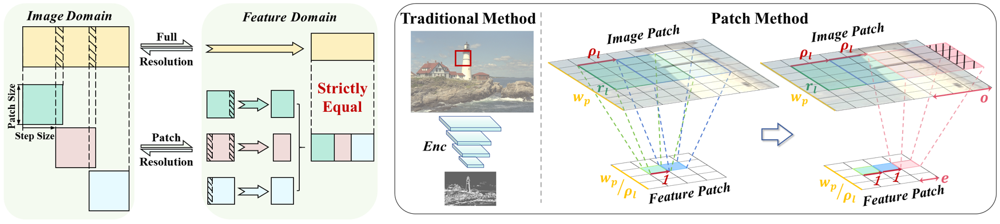

## Continuous Patch Stitching for Block-wise Image Compression

> [Zifu Zhang](https://github.com/bblgbr), Shengxi Li, Henan Liu, Mai Xu, Ce Zhu<br>
> :partying_face: This work is accepted by IEEE Signal Processing Letter.

<p align="center">
    <br>
</p>

### :book: Table Of Contents
- [:computer: Train](#computer-train)
- [:zap: Inference](#inference)
- [:heart: Acknowledgement](#acknowledgement)
- [:clipboard: Citation](#cite)

### :wrench: Requirements

```bash
- conda create -n cps python=3.8
- conda activate cps
- pip install compressai
- pip install pyyaml
- pip install easydict
- pip install tensorboard
```

### <a name="train"></a>:computer: Train

1. Prepare the training dataset and change the path in `./configs/xxx.yaml`.

```
   save_folder
   ├── train # train dataset
   └── test # test dataset
```

2. Run the following command.

```bash
   python train.py --config configs/cps_1_lambda00018.yaml
```

### <a name="inference"></a>:zap: Inference

1. Download the checkpoints into `./experiment`.

    | lambda   | Link|
    | --------- | ------------------ |
    | 0.0018  | [cps_6](https://drive.google.com/drive/folders/1y3POeiZtrqTMqX5kCusOegQsOoKtLmps?usp=sharing)             |
    | 0.0035  | [cps_5](https://drive.google.com/drive/folders/1y3POeiZtrqTMqX5kCusOegQsOoKtLmps?usp=sharing)             |
    | 0.00625  | [cps_4](https://drive.google.com/drive/folders/1y3POeiZtrqTMqX5kCusOegQsOoKtLmps?usp=sharing)              |
    | 0.013  | [cps_3](https://drive.google.com/drive/folders/1y3POeiZtrqTMqX5kCusOegQsOoKtLmps?usp=sharing)              |
    | 0.025  | [cps_2](https://drive.google.com/drive/folders/1y3POeiZtrqTMqX5kCusOegQsOoKtLmps?usp=sharing)              |
    | 0.0483  | [cps_1](https://drive.google.com/drive/folders/1y3POeiZtrqTMqX5kCusOegQsOoKtLmps?usp=sharing)              |

2. Download [test datasets](https://drive.google.com/drive/folders/1NkBLxPs7iXON7rEXZznz_bgkQhMWW0Kh?usp=drive_link).

- Kodak
- CLIC2020_val
- DIV8k

3. Run the following command.

   ```bash
   python test.py checkpoint --dataset Kodak -a cps-v4 \
   -p experiment/cps_1_lambda00018_v4_best_loss.pth.tar \
   -d output/cps_lambda00018_v4_patch256_Kodak \
   --config configs/cps_1_lambda00018.yaml --save-image --per-image --patch --cuda
   ```

### <a name="acknowledgement">:heart: Acknowledgement
This work is based on [Compressai](https://github.com/InterDigitalInc/CompressAI), thanks to the invaluable contributions.

## <a name="cite"></a>:clipboard: Citation

Please cite us if our work is useful for your research.

```
@article{zhang2025continuous,
  title={Continuous Patch Stitching for Block-wise Image Compression},
  author={Zhang, Zifu and Li, Shengxi and Liu, Henan and Xu, Mai and Zhu, Ce},
  journal={arXiv preprint arXiv:2502.16795},
  year={2025}
}
```